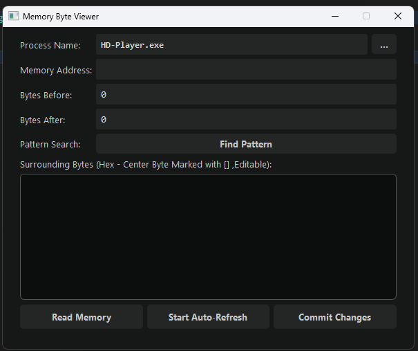
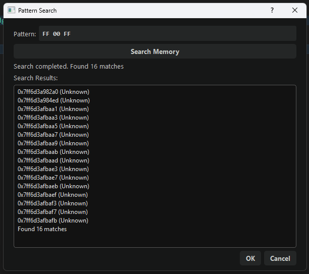
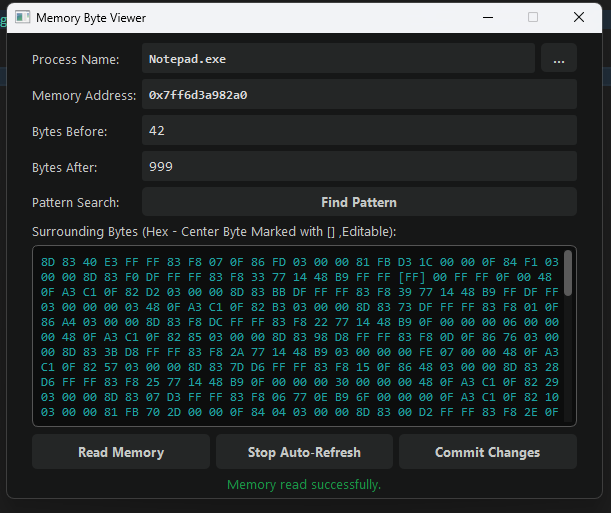
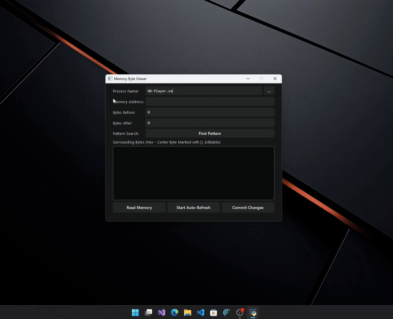

# 🚀 Memory Byte Viewer – PyQt5 + PyMem  
A modern, lightweight, Cheat-Engine–style memory viewer & AOB scanner.


## 🧠 Overview  
**Memory Byte Viewer** is an advanced GUI tool for inspecting, editing, and scanning the memory of Windows processes.  
Built with **Python, PyQt5, PyMem, and WinAPI**, it provides a clean, safe, and developer-friendly alternative to heavy native memory editors.

Perfect for:
- Reverse Engineering  
- Memory Debugging  
- Offline Game Research  
- Malware Analysis  
- OS & Memory Education  


## ✨ Features  
- 🔍 **Hex Memory Viewer** with syntax highlighting  
- ✏️ **Editable bytes** (modify & commit changes safely)  
- 🔥 **AOB Pattern Scanner** with wildcard support (`??`)  
- ⚡ **Auto-Refresh Mode** (live memory monitoring)  
- 🧩 **Process Explorer** (select any running process)  
- 🛡 **Uses VirtualProtectEx** for safe memory writing  
- 🎨 Modern **dark UI** optimized for readability  
- 🚫 Full error handling (safe even for beginners)


## 🖼 Screenshots  

### Main Window  
<p align="center">
  
</p>

### Pattern Scanner  
<p align="center">
  
</p>

### Memory Editor  
<p align="center">
  
</p>

---

## 🎥 Demo (GIF)  
> `assets/demo.gif`

<p align="center">
  
</p>


## 🎯 Use Cases  

### 🔹 Reverse Engineering  
- Inspect live memory  
- Detect function hooks  
- View code caves & JMP patches  

### 🔹 Debugging C/C++/C#  
- Inspect heap/stack structures  
- Patch runtime values  
- Troubleshoot pointer issues  

### 🔹 Game Memory Research (Offline & Educational Only)  
- Search offsets and signatures  
- Test patching  
- Explore emulator memory layouts  

### 🔹 Security & Malware Research  
- View decrypted payloads in RAM  
- Analyze suspicious memory regions  
- Detect remote injections  

---

## 📦 Installation  

### 1️⃣ Install Python 3.10+  
Download from: https://www.python.org/

### 2️⃣ Install dependencies  
```bash
pip install -r requirements.txt
```

### 3️⃣ Run the application  
```bash
python memory_viewer.py
```

---

## 🗂 Project Structure  
```
MemoryByteViewer/
│
├── memory_viewer.py
├── README.md
├── CONTRIBUTING.md
├── LICENSE
├── requirements.txt
├── assets/
│   ├── screenshot_main.png
│   ├── screenshot_pattern.png
│   ├── screenshot_edit.png
│   └── demo.gif
└── docs/
    └── MemoryByteViewer_Documentation.pdf
```

---

## 📘 Full Documentation  
A complete PDF guide is available here:  
```
docs/MemoryByteViewer_Documentation.pdf
```

## 🛡 Legal Notice  
This software is for **education, debugging, and security research only**.  
Do **NOT** use it on online games or commercial applications.


## 🧑‍💻 Author  
**Arman**  
Computer Engineer • Reverse Engineering • Systems Research  

If you enjoy this project, please consider giving it a **⭐ Star** on GitHub! 🌟  
